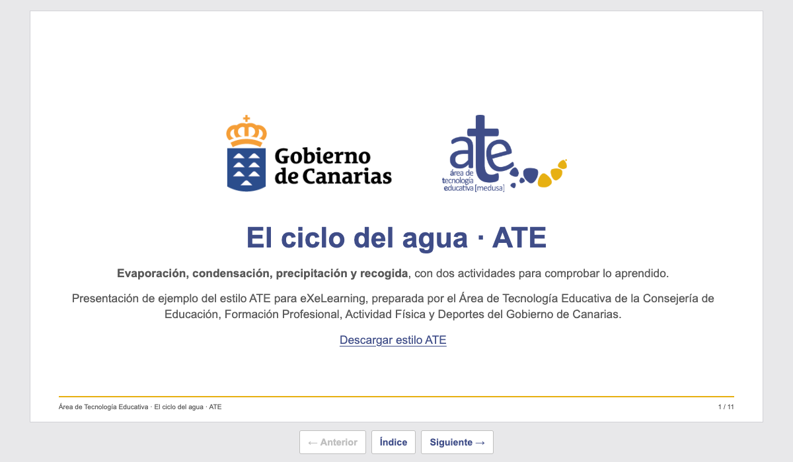

# eXeLearning ATE

[![eXeLearning 4.0.5+](https://img.shields.io/badge/eXeLearning-4.0.5%2B-26ddc7?labelColor=1f2937&logo=data%3Aimage%2Fsvg%2Bxml%3Bbase64%2CPHN2ZyB4bWxucz0iaHR0cDovL3d3dy53My5vcmcvMjAwMC9zdmciIHZpZXdCb3g9IjAgLTAuNTE5IDYwLjE3MTUyIDYwLjE3MTUyIj4gPGcgdHJhbnNmb3JtPSJ0cmFuc2xhdGUoLTEwOS44MDIwOCwtMTIxLjE3OTE3KSI%2BIDxwYXRoIGQ9Im0gMTIwLjYzOTEyLDEyMS4xNzkxNiBjIDIuNTAyOTYsMCA1LjE3Njg0LDAuOTEwMiA4LjAyMTExLDIuNzMwNiAyLjc4NzY1LDEuNzYzNSA2LjYyNzU1LDQuODkyMzMgMTEuNTE5Nyw5LjM4NjQ0IDguNDE5MywtNy4wNTQwNiAxMi45MTAzNCwtOC42NDMwMSAxNy4yMzM2MywtOC42NDMwMSAyLjc4NzY1LDAgNS4xNzY4NCwwLjc2Nzk4IDcuMTY3ODMsMi4zMDM5NCAzLjY2NzkyLDIuODA0NzcgNC4yNzk2Myw5LjIxMDIyIDEuNzEsMTMuNDIxNTcgLTIuMDQ3ODcsMy4zNTYzNyAtNC43MjE3NSw2Ljk2ODczIC04LjAyMTExLDEwLjgzNzAxIDcuNTA5MTQsOC41MzMwOCAxMS43MDMzMiwxNC42NzMgMTEuNzAzMzIsMTguODgyNzkgMCwzLjAxNDkyIC0wLjkzODc0LDUuMzE4OTIgLTIuODE1OTYsNi45MTE3MSAtMS45MzQxMSwxLjU5Mjc5IC00LjM1MTg3LDIuMzg5MTkgLTcuMjUzMDMsMi4zODkxOSAtNC4zODA0NCwwIC0xMS4yNDg0OSwtMy4zMjM3IC0xOS43MjQ2OCwtMTAuNDM0NjQgLTQuODM1MjYsNC4yNjY0IC04LjY0Njg1LDcuMjI0NzEgLTExLjQzNDI0LDguODc0MzkgLTIuODQ0NTMsMS42NDk2NyAtNS41NDY3MiwyLjQ3NDY1IC04LjEwNjU3LDIuNDc0NjUgLTMuNDEzMjMsMCAtNi4wNTg1LC0xLjEwOTQgLTcuOTM1NzgsLTMuMzI3OTMgLTEuOTM0MTgsLTIuMjc1NjggLTIuOTAxMjYsLTQuOTQ5MyAtMi45MDEyNiwtOC4wMjExMSAwLC0xLjk5MTI2IDAuMjg0NDMsLTMuNzI2MTMgMC44NTMzMSwtNS4yMDU0MSAwLjU2ODg4LC0xLjQ3OTAzIDEuNjIxMjksLTMuMTI4NyAzLjE1NzI1LC00Ljk0OTA0IDEuNTM1OTYsLTEuODc3NDggMy45ODIxMywtNC40NjU2MyA3LjMzODQ1LC03Ljc2NTI1IC0zLjI0MjU0LC0zLjI5OTM2IC01LjYzMTgxLC01Ljk0NDcxIC03LjE2NzgsLTcuOTM1NzYgLTEuNTkyODQsLTIuMDQ3OTUgLTIuNjczNjksLTMuODM5OTIgLTMuMjQyNTcsLTUuMzc1ODggLTAuNjI1NzcsLTEuNTM1OTYgLTAuOTM4NjQsLTMuMjQyNTcgLTAuOTM4NjQsLTUuMTE5ODcgMCwtMS45OTEwNyAwLjQyNjY0LC0zLjgzOTkgMS4yNzk5NSwtNS41NDY1MSAwLjg1MzM0LC0xLjc2MzUzIDIuMTA0ODQsLTMuMTg1NzIgMy43NTQ2LC00LjI2NjU4IDEuNjQ5NzMsLTEuMDgwODcgMy41ODM5MSwtMS42MjEzIDUuODAyNDksLTEuNjIxMyB6IiBmaWxsPSIjMjZkZGM3Ii8%2BIDwvZz4gPC9zdmc%2B)](https://exelearning.net)
[](https://github.com/ateeducacion/exelearning-style-ate/raw/refs/heads/main/content/resources/ate.zip)
[![Edit in eXeLearning](https://img.shields.io/badge/Edit%20in-eXeLearning-26ddc7?labelColor=1f2937&logo=data%3Aimage%2Fsvg%2Bxml%3Bbase64%2CPHN2ZyB4bWxucz0iaHR0cDovL3d3dy53My5vcmcvMjAwMC9zdmciIHZpZXdCb3g9IjAgLTAuNTE5IDYwLjE3MTUyIDYwLjE3MTUyIj4gPGcgdHJhbnNmb3JtPSJ0cmFuc2xhdGUoLTEwOS44MDIwOCwtMTIxLjE3OTE3KSI%2BIDxwYXRoIGQ9Im0gMTIwLjYzOTEyLDEyMS4xNzkxNiBjIDIuNTAyOTYsMCA1LjE3Njg0LDAuOTEwMiA4LjAyMTExLDIuNzMwNiAyLjc4NzY1LDEuNzYzNSA2LjYyNzU1LDQuODkyMzMgMTEuNTE5Nyw5LjM4NjQ0IDguNDE5MywtNy4wNTQwNiAxMi45MTAzNCwtOC42NDMwMSAxNy4yMzM2MywtOC42NDMwMSAyLjc4NzY1LDAgNS4xNzY4NCwwLjc2Nzk4IDcuMTY3ODMsMi4zMDM5NCAzLjY2NzkyLDIuODA0NzcgNC4yNzk2Myw5LjIxMDIyIDEuNzEsMTMuNDIxNTcgLTIuMDQ3ODcsMy4zNTYzNyAtNC43MjE3NSw2Ljk2ODczIC04LjAyMTExLDEwLjgzNzAxIDcuNTA5MTQsOC41MzMwOCAxMS43MDMzMiwxNC42NzMgMTEuNzAzMzIsMTguODgyNzkgMCwzLjAxNDkyIC0wLjkzODc0LDUuMzE4OTIgLTIuODE1OTYsNi45MTE3MSAtMS45MzQxMSwxLjU5Mjc5IC00LjM1MTg3LDIuMzg5MTkgLTcuMjUzMDMsMi4zODkxOSAtNC4zODA0NCwwIC0xMS4yNDg0OSwtMy4zMjM3IC0xOS43MjQ2OCwtMTAuNDM0NjQgLTQuODM1MjYsNC4yNjY0IC04LjY0Njg1LDcuMjI0NzEgLTExLjQzNDI0LDguODc0MzkgLTIuODQ0NTMsMS42NDk2NyAtNS41NDY3MiwyLjQ3NDY1IC04LjEwNjU3LDIuNDc0NjUgLTMuNDEzMjMsMCAtNi4wNTg1LC0xLjEwOTQgLTcuOTM1NzgsLTMuMzI3OTMgLTEuOTM0MTgsLTIuMjc1NjggLTIuOTAxMjYsLTQuOTQ5MyAtMi45MDEyNiwtOC4wMjExMSAwLC0xLjk5MTI2IDAuMjg0NDMsLTMuNzI2MTMgMC44NTMzMSwtNS4yMDU0MSAwLjU2ODg4LC0xLjQ3OTAzIDEuNjIxMjksLTMuMTI4NyAzLjE1NzI1LC00Ljk0OTA0IDEuNTM1OTYsLTEuODc3NDggMy45ODIxMywtNC40NjU2MyA3LjMzODQ1LC03Ljc2NTI1IC0zLjI0MjU0LC0zLjI5OTM2IC01LjYzMTgxLC01Ljk0NDcxIC03LjE2NzgsLTcuOTM1NzYgLTEuNTkyODQsLTIuMDQ3OTUgLTIuNjczNjksLTMuODM5OTIgLTMuMjQyNTcsLTUuMzc1ODggLTAuNjI1NzcsLTEuNTM1OTYgLTAuOTM4NjQsLTMuMjQyNTcgLTAuOTM4NjQsLTUuMTE5ODcgMCwtMS45OTEwNyAwLjQyNjY0LC0zLjgzOTkgMS4yNzk5NSwtNS41NDY1MSAwLjg1MzM0LC0xLjc2MzUzIDIuMTA0ODQsLTMuMTg1NzIgMy43NTQ2LC00LjI2NjU4IDEuNjQ5NzMsLTEuMDgwODcgMy41ODM5MSwtMS42MjEzIDUuODAyNDksLTEuNjIxMyB6IiBmaWxsPSIjMjZkZGM3Ii8%2BIDwvZz4gPC9zdmc%2B)](https://static.exelearning.dev/?url=https://github-proxy.exelearning.dev/?repo=ateeducacion/exelearning-style-ate&branch=main)

Estilo de eXeLearning para las **presentaciones del Área de Tecnología Educativa**
(Consejería de Educación, Formación Profesional, Actividad Física y Deportes del
Gobierno de Canarias). Cada página del recurso es una diapositiva 16:9 con la imagen
de los documentos del ATE: Arial, títulos en el azul del ATE, logotipos del Gobierno
de Canarias y del ATE, y el pie con filete amarillo. El ejemplo incluye las 11
diapositivas de **El ciclo del agua**, con actividades de ordenar las fases y
verdadero/falso.



[Descargar estilo ATE](https://github.com/ateeducacion/exelearning-style-ate/raw/refs/heads/main/content/resources/ate.zip) · [Abrir el ejemplo en eXeLearning](https://static.exelearning.dev/?url=https://github-proxy.exelearning.dev/?repo=ateeducacion/exelearning-style-ate&branch=main)

Importa `ate.zip` desde el gestor de estilos de eXeLearning 4.0.5 o posterior.
La raíz del repositorio es el ejemplo ELPX descomprimido; `theme/` contiene el estilo.
El botón «Edit with eXeLearning» es solo del ejemplo: está en `edit-in-exelearning.js`,
fuera del estilo, y no aparece en los recursos que se exporten con él.

## Presentar

- **Portada** (la primera página): la Marca del Gobierno de Canarias y el logotipo del
  ATE centrados, el título del recurso y el contenido de la página como subtítulo.
- **Diapositivas**: banda superior con el logotipo del Gobierno de Canarias y sus
  niveles emisores a la izquierda y el del ATE a la derecha, como en los documentos del
  ATE; debajo, el título de la
  página y el contenido (las ilustraciones se colocan a la derecha del texto). El pie
  lleva el filete amarillo, «Área de Tecnología Educativa», el título y el número de
  diapositiva. Si el contenido no cabe, se desplaza dentro de la diapositiva.
- **Teclado**: ← y →, Re Pág y Av Pág, y la barra espaciadora pasan de diapositiva;
  Inicio y Fin van a la primera y a la última. En los campos y las preguntas de las
  actividades las teclas siguen siendo de la actividad.
- **Botones** bajo la diapositiva: anterior, índice y siguiente. El índice es un
  diálogo con la lista de diapositivas, la ayuda y la licencia; Escape lo cierra.
- **Pantalla completa**: la del navegador (F11, o ⌃⌘F en macOS), que se mantiene al
  pasar de página.

En pantallas estrechas o verticales, sin JavaScript o al imprimir, el recurso se lee
como un documento con los logotipos arriba y el pie del ATE.

## Imagen del ATE

El estilo sigue la guía `DESIGN.md` de la skill
[documentos-ate](https://github.com/ateeducacion/skills): azul `#3F4D88` para títulos
y enlaces, azul claro `#DDE1EE` para cabeceras de tabla, amarillo `#E7B012` sólo para
el filete del pie, texto `#1A1A1A` y gris `#595959` para pies y notas. Arial (o
Liberation Sans, de métrica idéntica), sin degradados ni sombras. Las tablas llevan
filetes grises y cabecera azul claro con texto azul en negrita; las citas, cursiva gris
con filete azul. Las ilustraciones del ejemplo usan la misma paleta.

La colocación y el tamaño de los logotipos siguen el *Manual de Identidad Corporativa
del Gobierno de Canarias* (apartado 4.7, presentaciones multimedia de Consejerías, y 4.4,
marca con colaboradores), medido sobre una diapositiva de 190,5 mm de alto:

- **Interior**: banda superior de 6 mm + 12 mm + 6 mm; las dos marcas miden 12 mm de
  alto, el Gobierno de Canarias a la izquierda sobre la guía de 12 mm del contenido y el
  ATE a 6 mm del borde derecho.
- **Portada** (inicio y cierre): la Marca sin niveles emisores a la izquierda y el ATE a
  la derecha, a la misma altura, centrados entre Y/4 e Y/2 y separados Y/8.

En CSS, 1 mm equivale a 0,2953 cqw (la altura de la diapositiva es 56,25 cqw).

Los logotipos (`theme/img/`) son los de la cabecera de los documentos del ATE;
`logo-gobcan.png` es la Marca recortada de `logo-gobcan-dgoeii.png`, sin redibujar. No se
deforman ni se recolorean, y sólo deben usarse en materiales del ATE. Si cambia la
denominación de la Consejería o de la Dirección General, sustituye
`theme/img/logo-gobcan-dgoeii.png` por el oficial del
[portal de identidad gráfica del Gobierno de Canarias](https://www.gobiernodecanarias.org/identidadgrafica/).

## Vista previa y paquetes

```sh
python3 -m http.server 1314 --bind 127.0.0.1
python3 scripts/package.py
python3 scripts/check.py
```

Abre <http://localhost:1314/>. Los paquetes quedan en `dist/ate.zip` y
`dist/ciclo-del-agua.elpx`; el ZIP del estilo también se copia a `content/resources/`
para descargarlo desde el ejemplo.

Las comprobaciones de navegador usan Chrome y el Playwright que ya incluye eXeLearning:

```sh
NODE_PATH=/ruta/a/exelearning/node_modules node scripts/check-browser.cjs
```

Presentan las 11 diapositivas con el teclado comprobando que son 16:9, caben en la
ventana, llevan los logotipos y el número; prueban el índice, las dos actividades y la
lectura en el móvil. Para regenerar la miniatura, añade
`ATE_SCREENSHOT=theme/screenshot.png` al comando.

## Mantenimiento y publicación

La estructura de publicación procede de los demás estilos de la colección: Actions,
`.gitignore`, `.gitattributes`, licencia y notas de `git archive`.

- `python3 scripts/build_water_cycle.py`: reconstruye el ejemplo ELPX y el estilo
  desde los archivos actuales.
- `python3 scripts/color_icons.py /ruta/a/exelearning/public/files/perm/themes/base/zen/icons`:
  regenera los iconos de `theme/icons/` en el azul del ATE.
- Para regenerar las páginas HTML del ejemplo, exporta el ELPX con el CLI de
  eXeLearning desde su propio directorio:
  `bun dist/cli.js elp:export /ruta/a/dist/ciclo-del-agua.elpx /tmp/ate elpx`
  y copia `index.html`, `html/` y `search_index.js`.
  Después, `python3 scripts/package.py` vuelve a añadir el botón del ejemplo.

El workflow **Release** se ejecuta manualmente desde Actions o al subir una etiqueta
`v*`. Comprueba el ejemplo y genera `exelearning-style-ate-<versión>.zip`, `ate.zip` y
`ciclo-del-agua.elpx`. En una ejecución manual se guardan como artefactos; con una
etiqueta se adjuntan a la release.

## Colección de estilos

Estilos de eXeLearning del Área de Tecnología Educativa. Cada repositorio incluye el estilo y un recurso de ejemplo que se puede abrir directamente en eXeLearning.

<table>
  <tr>
    <td align="center" width="33%"><a href="https://github.com/ateeducacion/exelearning-style-book"><br><b>Libro</b></a><br><sub>Libro abierto con paso de página</sub></td>
    <td align="center" width="33%"><a href="https://github.com/ateeducacion/exelearning-style-pocket"><br><b>Pocket</b></a><br><sub>Consola portátil de pantalla verde</sub></td>
    <td align="center" width="33%"><a href="https://github.com/ateeducacion/exelearning-style-hacker"><br><b>Hacker</b></a><br><sub>Terminal con Matrix, Tron y PipBoy</sub></td>
  </tr>
  <tr>
    <td align="center" width="33%"><a href="https://github.com/ateeducacion/exelearning-style-spectrum128k"><br><b>Spectrum 128K</b></a><br><sub>ZX Spectrum con franjas y CRT</sub></td>
    <td align="center" width="33%"><a href="https://github.com/ateeducacion/exelearning-style-scumm"><br><b>SCUMM Adventure</b></a><br><sub>Aventura gráfica con verbos e inventario</sub></td>
    <td align="center" width="33%"><a href="https://github.com/ateeducacion/exelearning-style-boost"><br><b>Boost</b></a><br><sub>Moodle Boost con índice del curso</sub></td>
  </tr>
</table>

Los estilos oficiales para los centros educativos de Canarias (Flux, Nova y REF) están en [exelearning-styles-canarias](https://github.com/ateeducacion/exelearning-styles-canarias).

## Créditos y licencias

[Licencia general GPL-3.0](LICENSE), salvo los archivos que indican otra licencia:

- **Logotipos** del Gobierno de Canarias y del Área de Tecnología Educativa
  (`theme/img/logo-*.png`): marcas institucionales, no cubiertas por la GPL. Sólo para
  materiales del ATE.
- **Iconos de iDevices**: Material Symbols de Google, tomados del estilo Zen de
  eXeLearning y coloreados con `scripts/color_icons.py`, bajo
  [Apache License 2.0](theme/icons/LICENSE.txt).
- **Recurso de ejemplo** «El ciclo del agua» e ilustraciones: CC0 1.0, del Área de
  Tecnología Educativa, reutilizados de los estilos
  [Libro](https://github.com/ateeducacion/exelearning-style-book) y
  [Boost](https://github.com/ateeducacion/exelearning-style-boost); las ilustraciones
  SVG se han pasado a la paleta del ATE.

Los archivos de eXeLearning y sus bibliotecas conservan sus licencias originales.
